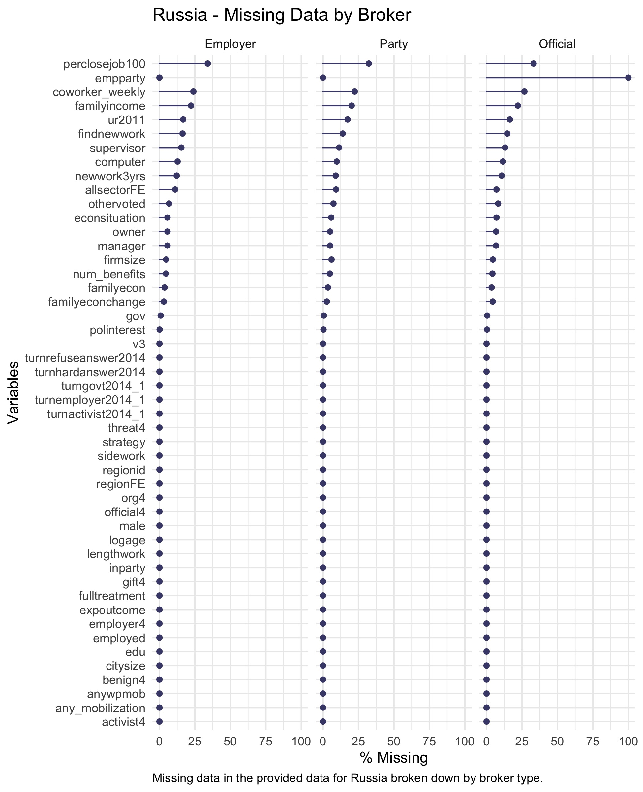
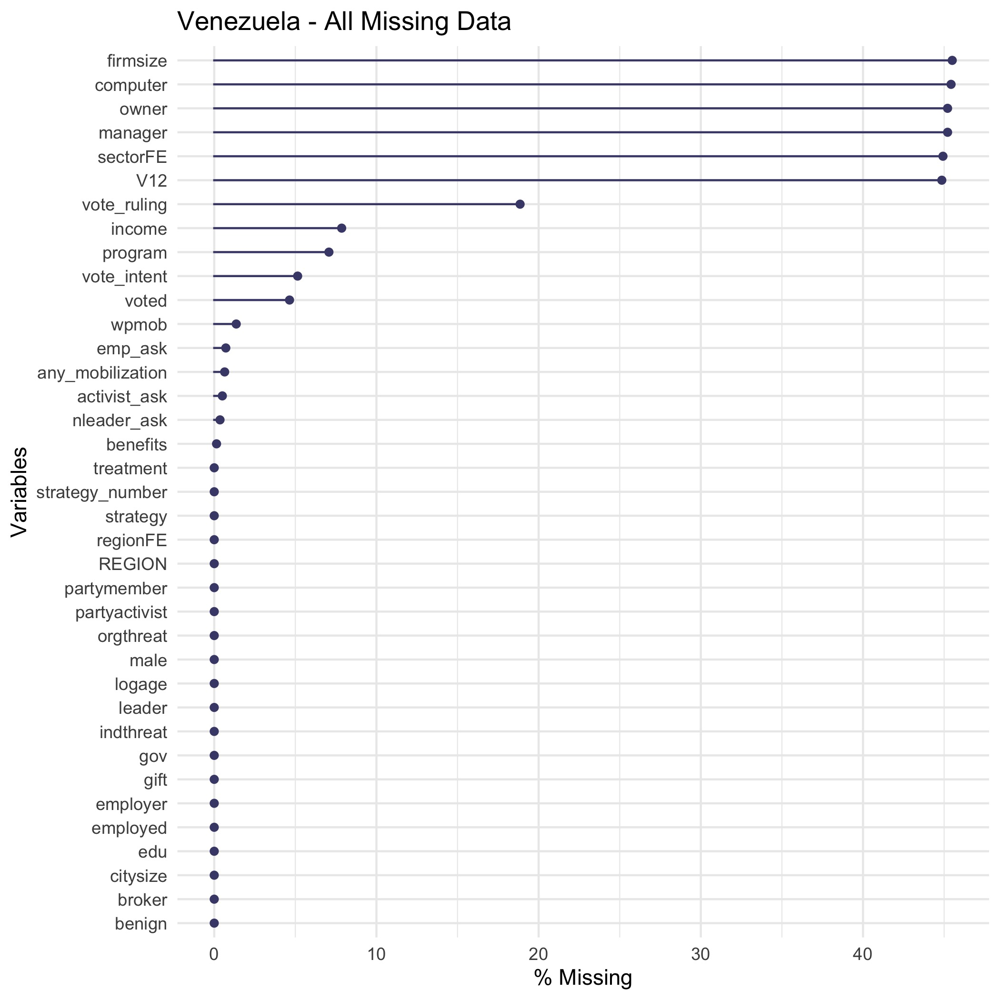
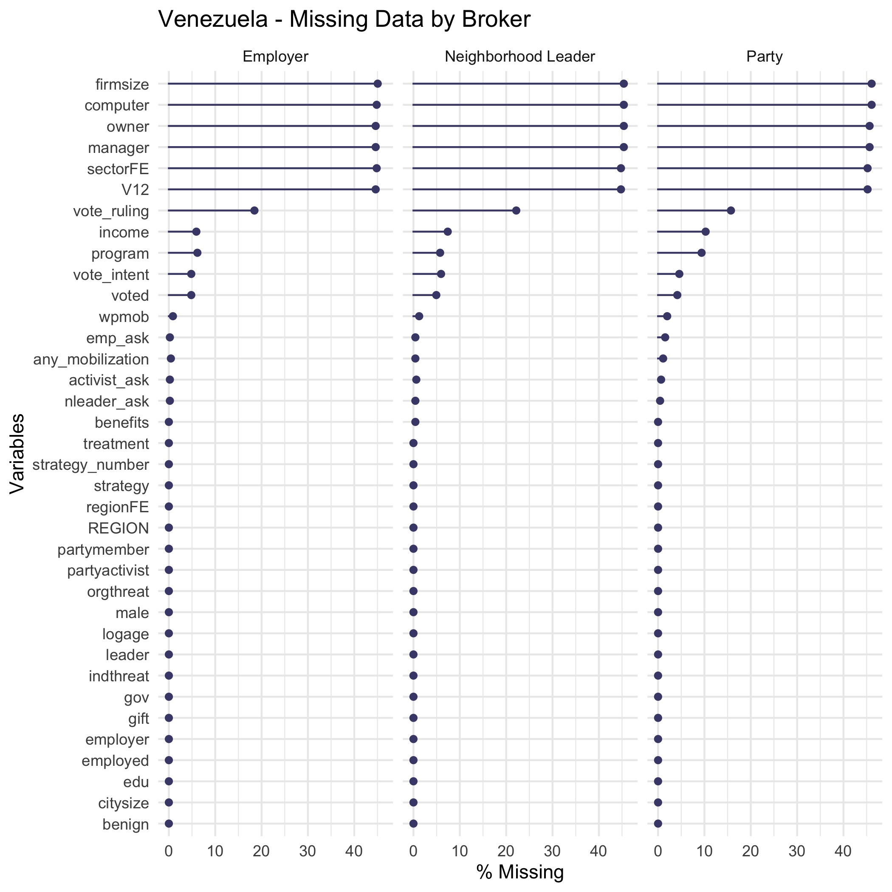
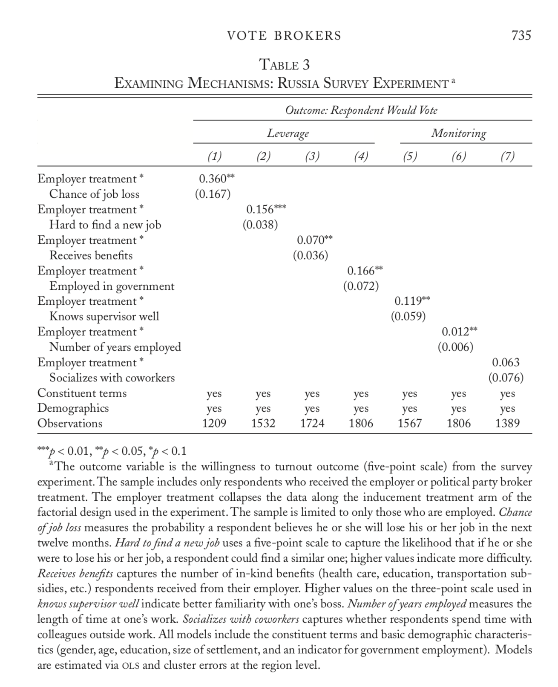

\newpage

\tableofcontents
\newpage

```{r setup, include=FALSE}
knitr::opts_chunk$set(echo = FALSE)

library(tinytex)
library(peRspective)
library(foreign)
library(data.table)
library(stargazer)
library(ggplot2)
library(xtable)
library(arm)
library(webshot)
library(mlogit)
library(naniar)
library(mice)
library(broom)
library(nnet)
library(ggpubr)
library(erer)
library(knitr)
library(huxtable)
library(lfe)
library(rms)
library(kableExtra)
library(tables)
library(formattable)
library(prediction)
library(glm.predict)
library(multcomp)
library(mfx)
library(gtable)
library(gridExtra)
library(grid)
library(stargazer)
library(data.table)
library(gt)
library(reprex)
library(tidyverse)

```


```{r loading data}

#### Load Each of the Survey Datasets
load("data/RussiaSurveyData.Rda")
load("data/VenezuelaSurveyData.Rda")

rus_emp<-subset(rus, employed==1)
ven_emp<-subset(ven, employed==1)

```


# Introduction

I am replicating "Vote Brokers, Clientelist Appeals, and Voter Turnout: Evidence from Russia and Venezuela" by Timothy Frye, Ora John Reuter and David Szakonyi.[^1] The authors use survey-based framework experiments conducted in Russia and Venezuela to analyze voter patterns and turnout in both countries respsectively. Their main finding is that there is higher voter turnout after a voter has been induced by an employer as opposed to a party activist. The results are consistent in both Venezuela and Russia, and are also consistent with existing literature on voter turnout, such as Mares and Young (2016), who also find that employer intimidation significantly influences voter turnout. The data are rich and from face to face interviews in both Russia and Venezuela, with the Venezuelan data coming from a stratified sample whereas the Russian from 20 regions. Thus, it appears that the Venezulean data is a more representative than the Russian. However I believe due to the random sampling and oversampling,the Russian data is still an accurate representation of Russian voters. The models used in the paper include using difference in means between brokers and between inducements, predicted probabilities from individual ordered logit regressions on respondents’ likelihood of voting in the survey experiment, and fixed effect linear regressions using interaction variables on willingness to vote.

I was able to sucessfully replicate the paper using the softward of @Rbaby. The source of the data and code used for this replication was generously provided online at the authors' publicly accesible Dataverse.[^2] The repo with my replication code and data can be found on Github at the link provided in the footnote. [^3]

[^1]:  \href{https://www.cambridge.org/core/journals/world-politics/article/vote-brokers-clientelist-appeals-and-voter-turnout-evidence-from-russia-and-venezuela/45FE0BE1216FCD8744B02A82919B328A}{{\underline{Frye, Reuter, and Szakonyi 2019}}}
[^2]: \href{https://dataverse.harvard.edu/dataset.xhtml?persistentId=doi:10.7910/DVN/YSVMS2}{{\underline{Frye, Reuter, and Szakonyi 2019 Dataverse}}}
[^3]: \href{https://github.com/cpatvakanian/Vote_Brokers_Replication}{{\underline{Author's Github Replication Repository}}}

For my extension of this paper, I decided to look at the missing values in this dataset. Given that the treatment assignment was random for all participants, it seemed unlikely that the misssing values the data would likely lead to any to any bias. However, as a robustness check, it is still an important contribution to ensure that the results we see are not due to potential sample bias in either country and that the data truly are missing at random. After imputing data using multivariate imputation by chained equations (MICE), I was able to create mutiple imputations or replacement values, for the gaps in the data. After running similar regressions provided in Table 3, I find results consistent with paper's originally findings, but lower in magitude.


# Literature Review

For this paper I looked at a few papers on voting structure in Russia, as I was able to find less on Venezuela. In "How Capitalism was Built", by Anders Aslund, the literature suggests that in many post soviet countries, voting patterns were heavily influenced by the transition to democracy in instiutions built. In Russia, the case was that there was not enough a big push to transform after communism, and thus the country had to face more difficulties in long term in ensuring fair and free elections. Additionally, in Olga Popova's "Corruption, Voting and Employment Status: Evidence from Russian Parliamentary Elections", Popova finds that controlling for different employment statuses and corruption, people are stil likely to vote differently, and more corruption generally induces people to vote more, which I think is to expected. Additionally, the analysis I found closest to this paper was in Mares and Young (2016), who find that employer intimidation significantly influences voter turnout.

# Replication

I was succesfully able to replicate all of the figures and the regression table provided in the paper based on the authors' provided data and code. 

# Extension

For my extension, I decided to look at missing data in the data sets and impute data for the regressions used in Table 3.  

\begin{center}

```{r Missing Data Russia, include= FALSE}

# I wanted to look at the missing data in my data
# set and see if there are any large gaps.

#summary(rus)

# Looking at missing values for Russia

Russia_all_miss <- gg_miss_var(rus, show_pct = TRUE) +
  labs(title = "Russia - All Missing Data")

ggsave(file="images/Russia_all_miss.jpg")

Russia_miss_brokers <- gg_miss_var(rus,
            show_pct = TRUE,
            facet = broker) +
  labs(title = "Russia - Missing Data by Broker")


ggsave(file="images/Russia_miss_brokers.jpg")


```





We see that for Russia, there is a lot of data missing for percentclose job, cowoerker_weekly, and findnewwork variables. When we further example data missing by broker, there generally seems to be the same variables missing with the exception being empparty for official, which is missing for 100% of the data.

```{r Missing Data Venezuela, include = FALSE}


#summary(ven)

# Looking at missing values for Russia

Ven_all_miss <- gg_miss_var(ven, show_pct = TRUE) +
  labs(title = "Venezuela - All Missing Data")

ggsave(file="images/Ven_all_miss.jpg")

Ven_miss_brokers <- gg_miss_var(ven,
            show_pct = TRUE,
            facet = broker) +
  labs(title = "Venezuela - Missing Data by Broker")

ggsave(file="images/Ven_miss_brokers.jpg")

```



\end{center}

We see that for Venezuela, there is a lot of data missing for firmsize, computer, manager, and sector variables. When we further example data missing by broker, there generally seems to be the same variables missing for all of the brokers. 


Given that the regression for Table 3 uses only data from Russia, I decided to impute the missing values using the mice(), function and re-run the regressions, which can be found in Table 2 of the appendix. When I compare my results with the imputed data and compare it to the original study, I find the same significance and sign of the coefficients, however the magnitude of the coefficients appears to be smaller in general. I think that this just shows the original study is valid and robust, and by being able to not only replicate the data but get very similar results to the original after imputing data, I feel even more confident in the authors' findings.

```{r imputing data Russia, cache = TRUE}

# Here I am using the mice function in order to get the imputed values
# for my missing data in the data set.

#imp_1 <- mice(rus, nnet.MaxNWts = 2000)

# Now I am saving that file to be and RDS so that I don't have to reimpute it
# and can use it again in further analysis

#saveRDS(imp_1, file = "imputed_Russia.rds")

# Here I am reading in the imputed data again

imp_1 <- read_rds("imputed_Russia.rds")

# Now I am creating a complete data set which 
# includes all of the imputed values,  I was not sure I
# I needed to pool them though.


full <- complete(imp_1, 1)

new <- complete(imp_1, action="long", include = TRUE) %>% as_tibble()


# Are ppl who don't report more or less likely to vote? don't report fear of losing bc theyre afraid of losing, most afraid won't say

# looking at actual value vs looking at if you reported or not

# could put all 5 in a single regression and
# run stanglm and report the coefficeint varaition on that


```

```{r Imputed Data Table}

# Using Russian data, here the autors are creating a table which shows a fixed effects linear
# model which is showing the outcome variable of voting, which
# is used since the paper wants to see the fixed effects based on the different
# categories of leverage, which in this case are people close they are to the job, 
# how they use network, how many benefits, and if they are government worker

est11 <-felm(expoutcome~empparty*perclosejob100+ citysize +  male + logage + polinterest  + edu+ gov|factor(strategy)|0|regionid, data=subset(new, employed==1))

est22 <-felm(expoutcome~empparty*findnewwork+ citysize +  male + logage + polinterest  + edu + gov|factor(strategy)|0|regionid, data=subset(new, employed==1))

est33 <-felm(expoutcome~empparty*num_benefits+ citysize +  male + logage + polinterest  + edu+ gov|factor(strategy)|0|regionid, data=subset(new, employed==1))

est44 <-felm(expoutcome~empparty*gov+ citysize +  male + logage + polinterest  + edu+ gov|factor(strategy)|0|regionid, data=subset(new, employed==1))

# Exact same thing as above except looking now at the same regression
# for the broker variables.

est55<-felm(expoutcome~empparty*supervisor+ citysize +  male + logage + polinterest  + edu+ gov|factor(strategy)|0|regionid, data=subset(new, employed==1))

est66<-felm(expoutcome~empparty*lengthwork+ citysize +  male + logage + polinterest  + edu+ gov|factor(strategy)|0|regionid, data=subset(new, employed==1))

est77<-felm(expoutcome~empparty*coworker_weekly+ citysize +  male + logage + polinterest  + edu+ gov|factor(strategy)|0|regionid, data=subset(new, employed==1))

```


```{r stargazer new, results="asis", echo=FALSE, warning= FALSE}

# Problem is from emp*party being in every single regression or GOV

# I wasn't getting any parsing issues
# but I had that error so I put warning equals false

# I had some trouble geting rid of residual standard error
# and also was a little stuck on putting the demographics
# and constituent terms like in the original paper. Also,
# some of the smaller formatting and labelling issues I didn't
# address but I will fix them in the future.

stargazer(est11, est22, est33,est44, est55, est66, est77, header = FALSE,
          dep.var.labels=c("Outcome Respondent Would Vote"),
      notes = "\\parbox[t]{10cm}{The outcome variable is the willingness to turnout outcome (five-point scale) from the survey
experiment. The sample includes only respondents who received the employer or political party broker treatment. The employer treatment collapses the data along the inducement treatment arm of the factorial design used in the experiment. The sample is limited to only those who are employed. Chance of job loss measures the probability a respondent believes he or she will lose his or her job in the next twelve months. Hard to find a new job uses a five-point scale to capture the likelihood that if he or she were to lose his or her job, a respondent could find a similar one; higher values indicate more difficulty. Receives benefits captures the number of in-kind benefits (health care, education, transportation sub- sidies, etc.) respondents received from their employer. Higher values on the three-point scale used in knows supervisor well indicate better familiarity with one’s boss. Number of years employed measures the length of time at one’s work. Socializes with coworkers captures whether respondents spend time with colleagues outside work. All models include the constituent terms and basic demographic characteris- tics (gender, age, education, size of settlement, and an indicator for government employment). Models are estimated via ols and cluster errors at the region level.}",
      single.row = FALSE,
          column.sep.width = "-5pt",
      keep=c("empparty:perclosejob100","empparty:findnewwork","empparty:num_benefits","empparty:gov","empparty:supervisor","empparty:lengthwork","empparty:coworker_weekly" ),
      column.labels   = c("Leverage", "Monitoring"),
df = FALSE,
      omit.stat=c("rsq","adj.rsq", "ser"),
        column.separate = c(4, 3),
      order = c(4,1,2,3,5,6,7))

```

# Conclusion

In this paper, I was succesffuly able to replicate all of the results of Frye, Reuter and Szakony (2019). The the use of a robustness test, I was able impute missing values in the dataset and find results in line with that of the original study, but of a smaller magnitude. These results confirm the authors' original findings and suggest that the missing values in their sampled population do not bias the results. The implications of this replication and extension are that future studies in this area can build on these existing results and have confidence that the findings of Frye, Reuter and Szakony (2019) are in fact robust.

# References

I make use of @Rbaby, @aslund_2012, @popova, @mares and @frye_reuter_szakonyi_2019. 

<div id="refs"></div>

# Appendix

## Figure 1

```{r making figure 1}
# Creating first table with two panels

# Panel A - They create a table that shows
# the various likelihoods of people voting
# and specifies this using a gg plot. There is a lot 
# of formatting to make it the size, text, font, and labels
# desired. This is done for Russia and Venezeula

## Made continous scale....


####### Panel A

rus_d<-rus[rus$employed==1][,list(expoutcome_m=mean(expoutcome)),by=c("strategy","broker")]
rus_d$broker<-as.character(rus_d$broker)
rus_d$broker[rus_d$broker=="Employer"]<-" Employer"
rus_d$broker[rus_d$broker=="Party"]<-" Party Activist"
rus_d$broker[rus_d$broker=="Official"]<-"Government Official"

fig1_panela<-ggplot(data=rus_d, aes(x=broker, y=expoutcome_m, fill=strategy)) + geom_bar(colour="black", stat="identity",position=position_dodge(),size=.3)+ scale_fill_grey( name="",breaks=c("0", "1", "2","3"),labels=c("Simple Ask     ", "Organizational Threat     ", "Turnout-Buying     ","Individual Threat"))+    xlab("") + ylab("Likelihood of Voting") + theme_bw()+ theme(legend.position="bottom",axis.text=element_text(size=10),axis.text.x=element_text(face = "bold"),axis.title.y=element_text(size=10),legend.text=element_text(size=10),plot.title = element_text(hjust = 0.5,size=14),plot.caption = element_text(hjust = 0))+ coord_cartesian(ylim=c(2.25,3.25))+ geom_text(aes(label=specify_decimal(expoutcome_m,2)), position=position_dodge(width=0.9), vjust=-0.4)+ggtitle("Panel A: Russia Survey")

####### Panel B

ven_d<-ven[ven$employed==1][,list(vote_intent_m=mean(vote_intent,na.rm=TRUE)),by=c("strategy_number","broker")]
ven_d$broker<-as.character(ven_d$broker)
ven_d$broker[ven_d$broker=="Employer"]<-" Employer"
ven_d$broker[ven_d$broker=="Party"]<-" Party Activist"
ven_d$broker[ven_d$broker=="Official"]<-"Neighborhood Leader"

fig1_panelb<-ggplot(data=ven_d, aes(x=broker, y=vote_intent_m, fill=strategy_number)) + geom_bar(colour="black", stat="identity",position=position_dodge(),size=.3)+ scale_fill_grey( name="",breaks=c("0", "1", "2","3"),labels=c("Simple Ask     ", "Organizational Threat     ", "Turnout-Buying     ","Individual Threat"))+    xlab("") + ylab("Likelihood of Voting") + theme_bw()+ theme(legend.position="bottom",axis.text=element_text(size=10),axis.text.x=element_text(face = "bold"),axis.title.y=element_text(size=10),legend.text=element_text(size=10),plot.title = element_text(hjust = 0.5,size=14),plot.caption = element_text(hjust = 0))+ coord_cartesian(ylim=c(2,4.5))+ geom_text(aes(label=specify_decimal(vote_intent_m,2)), position=position_dodge(width=0.9), vjust=-0.4)+ggtitle("\n\nPanel B: Venezuela Survey")


ggarrange(fig1_panela, fig1_panelb, ncol=1, nrow=2, common.legend = TRUE, legend="bottom") + 
  labs(caption = "The figure displays the difference in the likelihood of voting among all respondents to the survey experiment.\nVoting likelihood is measured on a five-point scale, with higher values indicating increased likelihood.\nMean values for each treatment group are found above each bar and are organized according to which broker was\nresponsible for voter mobilization.The sample is a subset of only employed respondents.")
```

## Figure 2

```{r making figure 2}

# I don't understand what's going on here with the
# interval but I guess he is showing some kind of 
# interval he'd like to have the error display 
# on the graphic which display difference of means

interval <- -qnorm((1-0.95)/2)  # 95% multiplier

# This code produces Panel A which is separated based on each country
# and looks at brokers vs inducements

# This code here is to specify the employed brokers in several categories and their
# differences using a linear regression
emp_diff<-lm(expoutcome~factor(employer4), data=subset(rus,employed==1))
party_diff<-lm(expoutcome~factor(activist4), data=subset(rus,employed==1))
official_diff<-lm(expoutcome~factor(official4), data=subset(rus,employed==1))

# He we have displayed the various inducements applied and again using
# the linear regression to get the differnce of means

gift_diff<-lm(expoutcome~factor(gift4), data=subset(rus,employed==1))
threat_diff<-lm(expoutcome~factor(threat4), data=subset(rus,employed==1))
benign_diff<-lm(expoutcome~factor(benign4), data=subset(rus,employed==1))
org_diff<-lm(expoutcome~factor(org4), data=subset(rus,employed==1))

# Here creating a coeffiecents column in order to make sure there are fixed effects accounted for
coefficients<-data.frame(var=as.character(),fe = as.numeric(),se= as.numeric(), subset=as.character())

# Here we are setting the standard error between the 
# different inducements in order to get the proper displayed
# numbers in the table

coefficients<-rbind(coefficients,data.frame(var="strategies",fe = summary(benign_diff)$coefficients[,1][2],se= summary(benign_diff)$coefficients[,2][2], subset="Simple Ask     "))

coefficients<-rbind(coefficients,data.frame(var="strategies",fe = summary(org_diff)$coefficients[,1][2],se= summary(org_diff)$coefficients[,2][2], subset="Organizational Threat     "))

coefficients<-rbind(coefficients,data.frame(var="strategies",fe = summary(gift_diff)$coefficients[,1][2],se= summary(gift_diff)$coefficients[,2][2], subset="Turnout-Buying     "))

coefficients<-rbind(coefficients,data.frame(var="strategies",fe = summary(threat_diff)$coefficients[,1][2],se= summary(threat_diff)$coefficients[,2][2], subset="Individual Threat"))

# Again doing the same as the above except for the brokers in this case, parsing
# for the different types of brokers
coefficients<-rbind(coefficients,data.frame(var="brokers",fe = summary(emp_diff)$coefficients[,1][2],se= summary(emp_diff)$coefficients[,2][2], subset="Employer"))
coefficients<-rbind(coefficients,data.frame(var="brokers",fe = summary(party_diff)$coefficients[,1][2],se= summary(party_diff)$coefficients[,2][2], subset="Party Activist"))
coefficients<-rbind(coefficients,data.frame(var="brokers",fe = summary(official_diff)$coefficients[,1][2],se= summary(official_diff)$coefficients[,2][2], subset="Government Official"))

# not sure what's going on here
coefficients <- within(coefficients,
                       var <- ordered(var, levels = rev(sort(unique(var)))))
secbreaks = rev(unique(as.character(coefficients$var)))

# Creating the GG plot for this graph again with the visual 
# specifications and making sure that the se error range is displayed

fig2_panela<-ggplot(coefficients, aes(colour = subset))+ geom_hline(yintercept = 0, colour = gray(1/2), lty = 2)+ geom_linerange(aes(x = var, ymin = fe - se*interval, ymax = fe + se*interval),lwd = 1, position = position_dodge(width = 1/2))+ geom_pointrange(aes(x = var, y = fe, ymin = fe - se*interval,ymax = fe + se*interval), lwd = 1/2, position = position_dodge(width = 1/2), shape = 21, fill = "WHITE")+ theme_bw()+ ylab("Difference in Means")+ xlab(" ")+ scale_x_discrete(breaks=secbreaks,labels=c('Difference: Between Brokers','\nDifference: Between Inducements')) + guides(colour=guide_legend(ncol=2))+ scale_colour_grey(name="Inducements                              Brokers")+theme(axis.text = element_text(size=10),axis.title = element_text(size=12),legend.text=element_text(size=10),plot.title = element_text(hjust = 1.25,size=10))+ggtitle("Panel A: Russia Survey")

####### Panel B - EXACT SAME THING AS ABOVE FOR VENEZUELA!

### Brokers
emp_diff<-lm(vote_intent~factor(employer), data=subset(ven,employed==1))
party_diff<-lm(vote_intent~factor(partyactivist), data=subset(ven,employed==1))
leader_diff<-lm(vote_intent~factor(leader), data=subset(ven,employed==1))

### Strategies
gift_diff<-lm(vote_intent~factor(gift), data=subset(ven,employed==1))
threat_diff<-lm(vote_intent~factor(indthreat), data=subset(ven,employed==1))
benign_diff<-lm(vote_intent~factor(benign), data=subset(ven,employed==1))
org_diff<-lm(vote_intent~factor(orgthreat), data=subset(ven,employed==1))

coefficients<-data.frame(var=as.character(),fe = as.numeric(),se= as.numeric(), subset=as.character())

coefficients<-rbind(coefficients,data.frame(var="strategies",fe = summary(benign_diff)$coefficients[,1][2],se= summary(benign_diff)$coefficients[,2][2], subset="Simple Ask     "))
coefficients<-rbind(coefficients,data.frame(var="strategies",fe = summary(org_diff)$coefficients[,1][2],se= summary(org_diff)$coefficients[,2][2], subset="Organizational Threat     "))
coefficients<-rbind(coefficients,data.frame(var="strategies",fe = summary(gift_diff)$coefficients[,1][2],se= summary(gift_diff)$coefficients[,2][2], subset="Turnout-Buying     "))
coefficients<-rbind(coefficients,data.frame(var="strategies",fe = summary(threat_diff)$coefficients[,1][2],se= summary(threat_diff)$coefficients[,2][2], subset="Individual Threat"))

coefficients<-rbind(coefficients,data.frame(var="brokers",fe = summary(emp_diff)$coefficients[,1][2],se= summary(emp_diff)$coefficients[,2][2], subset="Employer"))
coefficients<-rbind(coefficients,data.frame(var="brokers",fe = summary(party_diff)$coefficients[,1][2],se= summary(party_diff)$coefficients[,2][2], subset="Party Activist"))
coefficients<-rbind(coefficients,data.frame(var="brokers",fe = summary(leader_diff)$coefficients[,1][2],se= summary(leader_diff)$coefficients[,2][2], subset="Neighborhood Leader"))

coefficients <- within(coefficients,
                       var <- ordered(var, levels = rev(sort(unique(var)))))
secbreaks = rev(unique(as.character(coefficients$var)))

fig2_panelb<-ggplot(coefficients, aes(colour = subset))+ geom_hline(yintercept = 0, colour = gray(1/2), lty = 2)+ geom_linerange(aes(x = var, ymin = fe - se*interval, ymax = fe + se*interval),lwd = 1, position = position_dodge(width = 1/2))+ geom_pointrange(aes(x = var, y = fe, ymin = fe - se*interval,ymax = fe + se*interval), lwd = 1/2, position = position_dodge(width = 1/2), shape = 21, fill = "WHITE")+ theme_bw()+ ylab("Difference in Means")+ xlab(" ")+ scale_x_discrete(breaks=secbreaks,labels=c('Difference: Between Brokers','\nDifference: Between Inducements')) +  guides(colour=guide_legend(ncol=2))+ scale_colour_grey(name="Inducements                              Brokers")+theme(axis.text = element_text(size=10),axis.title = element_text(size=12),legend.text=element_text(size=10),plot.title = element_text(hjust = 1.25,size=10))+ggtitle("Panel B: Venezuela Survey")


ggarrange(fig2_panela, fig2_panelb, ncol=1, nrow=2, common.legend = TRUE, legend="bottom")

# Set height and width options

```

## Figure 3

```{r making figure 3}
# Similar concept to above, making a visual
# reprentation of the difference of means
# except in this case looking at treated vs
# non treated


# creating dataframe upon which the authors later
# add data to create table
df <- data.frame(name= numeric(0),coefs= numeric(0),se= numeric(0),value= numeric(0))

### First we are looking at the effect of leverage
# on the subgroups specified

# I think this is creating a specific characteristic of person they want
# to count but i am not certain
est1<-felm(expoutcome~empparty*perclosejob100+ citysize +  male + logage + edu+ gov|factor(strategy)|0|regionid, data=subset(rus, employed==1))

# I think this is adding another column to dataframe in order to make
# a variable of close to the employer, but the variable name is confusing
df<-rbind(df,cbind("perclosejob100",
                   summary(glht(est1, linfct = c("empparty + empparty:perclosejob100 == 0")))$test$coefficients,
                   summary(glht(est1, linfct = c("empparty + empparty:perclosejob100 == 0")))$test$sigma,"1"))

df<-rbind(df,cbind("perclosejob100",
                   summary(glht(est1, linfct = c("empparty==0")))$test$coefficients,
                   summary(glht(est1, linfct = c("empparty==0")))$test$sigma,"0"))

# Here adding a varible for the dataframe to count people who 
# monitoring and within the newer group
est2<-felm(expoutcome~empparty*findnewwork+ citysize +  male + logage + edu + gov|factor(strategy)|0|regionid, data=subset(rus, employed==1))

df<-rbind(df,cbind("findnewwork",
                   summary(glht(est2, linfct = c("empparty + empparty:findnewwork*5 == 0")))$test$coefficients,
                   summary(glht(est2, linfct = c("empparty + empparty:findnewwork*5 == 0")))$test$sigma,"1"))

df<-rbind(df,cbind("findnewwork",
                   summary(glht(est2, linfct = c("empparty==0")))$test$coefficients,
                   summary(glht(est2, linfct = c("empparty==0")))$test$sigma,"0"))

rus$num_benefits<-as.numeric(as.character(rus$num_benefits))
est3<-felm(expoutcome~empparty*num_benefits+ citysize +  male + logage + edu+ gov|factor(strategy)|0|regionid, data=subset(rus, employed==1))

# adding a variable that is part of leverage subgroup for
# someone receiving benefits
df<-rbind(df,cbind("num_benefits",
                   summary(glht(est3,linfct = c("empparty + empparty:num_benefits == 0")))$test$coefficients,
                   summary(glht(est3, linfct = c("empparty + empparty:num_benefits == 0")))$test$sigma,"1"))

df<-rbind(df,cbind("num_benefits",
                   summary(glht(est3, linfct = c("empparty==0")))$test$coefficients,
                   summary(glht(est3, linfct = c("empparty==0")))$test$sigma,"0"))

# Again, same as above except for people employed
# in the government
est4<-felm(expoutcome~empparty*gov+ citysize +  male + logage + edu+gov|factor(strategy)|0|regionid, data=subset(rus, employed==1))

df<-rbind(df,cbind("gov",
                   summary(glht(est4, linfct = c("empparty + empparty:gov == 0")))$test$coefficients,
                   summary(glht(est4, linfct = c("empparty + empparty:gov == 0")))$test$sigma,"1"))

df<-rbind(df,cbind("gov",
                   summary(glht(est4, linfct = c("empparty==0")))$test$coefficients,
                   summary(glht(est4, linfct = c("empparty==0")))$test$sigma,"0"))

### Here creating the same variables as above and adding more values to the 
# data frame for their subgroups, except for MONITORING

est5<-felm(expoutcome~empparty*supervisor+ citysize +  male + logage + edu+ gov|factor(strategy)|0|regionid, data=subset(rus, employed==1))


df<-rbind(df,cbind("supervisor",
                   summary(glht(est5, linfct = c("empparty + empparty:supervisor*3 == 0")))$test$coefficients,
                   summary(glht(est5, linfct = c("empparty + empparty:supervisor*3 == 0")))$test$sigma,"1"))

df<-rbind(df,cbind("supervisor",
                   summary(glht(est5, linfct = c("empparty==0")))$test$coefficients,
                   summary(glht(est5, linfct = c("empparty==0")))$test$sigma,"0"))

est6<-felm(expoutcome~empparty*lengthwork+ citysize +  male + logage + edu+ gov|factor(strategy)|0|regionid, data=subset(rus, employed==1))

df<-rbind(df,cbind("lengthwork",
                   summary(glht(est6, linfct = c("empparty + empparty:lengthwork*50 == 0")))$test$coefficients,
                   summary(glht(est6, linfct = c("empparty + empparty:lengthwork*50 == 0")))$test$sigma,"1"))

df<-rbind(df,cbind("lengthwork",
                   summary(glht(est6, linfct = c("empparty==0")))$test$coefficients,
                   summary(glht(est6, linfct = c("empparty==0")))$test$sigma,"0"))


est7<-felm(expoutcome~empparty*coworker_weekly+ citysize +  male + logage + edu+ gov|factor(strategy)|0|regionid, data=subset(rus, employed==1))

df<-rbind(df,cbind("coworker_weekly",
                   summary(glht(est7, linfct = c("empparty + empparty:coworker_weekly*2 == 0")))$test$coefficients,
                   summary(glht(est7, linfct = c("empparty + empparty:coworker_weekly*2 == 0")))$test$sigma,"1"))

df<-rbind(df,cbind("coworker_weekly",
                   summary(glht(est7, linfct = c("empparty==0")))$test$coefficients,
                   summary(glht(est7, linfct = c("empparty==0")))$test$sigma,"0"))

# not sure what's going on here again with the coefficients column
# but it seems to make sense
coefficients <- within(coefficients,
                       var <- ordered(var, levels = rev(sort(unique(var)))))
secbreaks = rev(unique(as.character(coefficients$var)))


# Here creating new variable names so that it be easily
# put into the gg plot below and adding the variables
# to the datafarme as characters
names(df)<-c("variable","coef","se","on")
df$leverage<-c(rep(1,8),rep(0,6))
df$coef<-as.numeric(as.character(df$coef))
df$se<-as.numeric(as.character(df$se))
df$variable<-as.character(df$variable)
df$variable[df$variable=="perclosejob100"]<-"     perclosejob100"
df$variable[df$variable=="findnewwork"]<-"    findnewwork"
df$variable[df$variable=="num_benefits"]<-"    num_benefits"
df$variable[df$variable=="gov"]<-"   gov"
df$variable[df$variable=="supervisor"]<-"  supervisor"
df$variable[df$variable=="lengthwork"]<-" lengthwork"
df$variable[df$variable=="coworker_weekly"]<-"coworker_weekly"
df$leverage<-as.character(df$leverage)

# I don't exactly know what's going on here
# but I don think they are just going through and 
# making certain variables factors

df$variablewhite = factor(df$variable, levels=c("Leverage ","     perclosejob100","    findnewwork", "    num_benefits","   gov","Monitoring","  supervisor"," lengthwork","coworker_weekly"))

# I don't know what's happening here at all
df$variablefill<-paste(df$variable,df$on,sep="_")


# Here creating a ggplot with variables to 
# a table that shows the standard errors
# of the different respondents
fig3<-ggplot(df, aes(colour = variable,fill=variablefill))+ geom_linerange(aes(x = variablefill, ymin = coef - se*interval, ymax = coef + se*interval),lwd = 1, position = position_dodge(width = 1/2))+ geom_pointrange(aes(x = variablefill, y = coef, ymin = coef - se*interval,ymax = coef + se*interval), lwd = 1/2, position = position_dodge(width = 1/2), shape = 21, fill = "WHITE")+ geom_hline(yintercept = 0, colour = gray(1/2), lty = 2)+ theme_bw()+ scale_x_discrete(breaks=df$variablefill,labels=c('100','0','Yes','No','Yes','No','Yes','No','Yes','No','50','0','Yes','No'))+ ylab("Effect of Employer Treatment\n on Turnout")+ xlab("\nLeverage                            Monitoring")+
  guides(colour=guide_legend(ncol=2))+ scale_colour_grey(name="",labels = c("Chance of Job Loss", "Hard to Find a New Job","Receives Benefits","Employed in Government","Knows Supervisor Well","Number of Years Employed","Socializes with Coworkers"))+theme(legend.position="bottom",axis.text = element_text(size=10),axis.title = element_text(size=12),legend.text=element_text(size=8))

fig3
```

## Table 3

```{r creating table 3}

# Using Russian data, here the autors are creating a table which shows a fixed effects linear
# model which is showing the outcome variable of voting, which
# is used since the paper wants to see the fixed effects based on the different
# categories of leverage, which in this case are people close they are to the job, 
# how they use network, how many benefits, and if they are government worker

est1 <-felm(expoutcome~empparty*perclosejob100+ citysize +  male + logage + polinterest  + edu+ gov|factor(strategy)|0|regionid, data=subset(rus, employed==1))

est2 <-felm(expoutcome~empparty*findnewwork+ citysize +  male + logage + polinterest  + edu + gov|factor(strategy)|0|regionid, data=subset(rus, employed==1))

est3 <-felm(expoutcome~empparty*num_benefits+ citysize +  male + logage + polinterest  + edu+ gov|factor(strategy)|0|regionid, data=subset(rus, employed==1))

est4 <-felm(expoutcome~empparty*gov+ citysize +  male + logage + polinterest  + edu+ gov|factor(strategy)|0|regionid, data=subset(rus, employed==1))

# Exact same thing as above except looking now at the same regression
# for the broker variables.

est5<-felm(expoutcome~empparty*supervisor+ citysize +  male + logage + polinterest  + edu+ gov|factor(strategy)|0|regionid, data=subset(rus, employed==1))

est6<-felm(expoutcome~empparty*lengthwork+ citysize +  male + logage + polinterest  + edu+ gov|factor(strategy)|0|regionid, data=subset(rus, employed==1))

est7<-felm(expoutcome~empparty*coworker_weekly+ citysize +  male + logage + polinterest  + edu+ gov|factor(strategy)|0|regionid, data=subset(rus, employed==1))

```

```{r stargazer12345, results="asis", echo=FALSE, warning= FALSE}

# Problem is from emp*party being in every single regression or GOV

# I wasn't getting any parsing issues
# but I had that error so I put warning equals false

# I had some trouble geting rid of residual standard error
# and also was a little stuck on putting the demographics
# and constituent terms like in the original paper. Also,
# some of the smaller formatting and labelling issues I didn't
# address but I will fix them in the future.

stargazer(est1, est2, est3,est4, est5, est6, est7, header = FALSE,
          dep.var.labels=c("Outcome Respondent Would Vote"),
      notes = "\\parbox[t]{10cm}{The outcome variable is the willingness to turnout outcome (five-point scale) from the survey
experiment. The sample includes only respondents who received the employer or political party broker treatment. The employer treatment collapses the data along the inducement treatment arm of the factorial design used in the experiment. The sample is limited to only those who are employed. Chance of job loss measures the probability a respondent believes he or she will lose his or her job in the next twelve months. Hard to find a new job uses a five-point scale to capture the likelihood that if he or she were to lose his or her job, a respondent could find a similar one; higher values indicate more difficulty. Receives benefits captures the number of in-kind benefits (health care, education, transportation sub- sidies, etc.) respondents received from their employer. Higher values on the three-point scale used in knows supervisor well indicate better familiarity with one’s boss. Number of years employed measures the length of time at one’s work. Socializes with coworkers captures whether respondents spend time with colleagues outside work. All models include the constituent terms and basic demographic characteris- tics (gender, age, education, size of settlement, and an indicator for government employment). Models are estimated via ols and cluster errors at the region level.}",
      single.row = FALSE,
          column.sep.width = "-5pt",
      keep=c("empparty:perclosejob100","empparty:findnewwork","empparty:num_benefits","empparty:gov","empparty:supervisor","empparty:lengthwork","empparty:coworker_weekly" ),
      column.labels   = c("Leverage", "Monitoring"),
df = FALSE,
      omit.stat=c("rsq","adj.rsq", "ser"),
        column.separate = c(4, 3),
      order = c(4,1,2,3,5,6,7))

```


